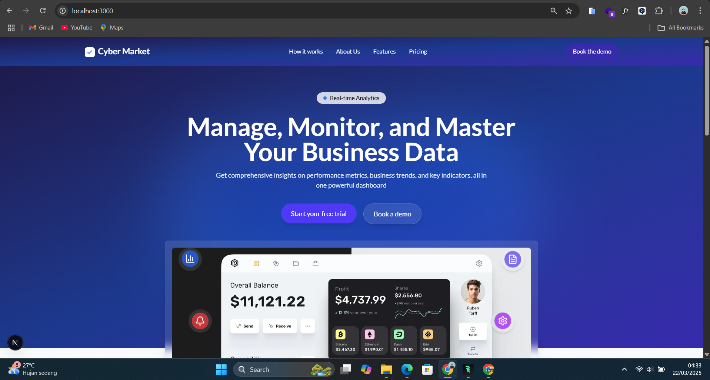
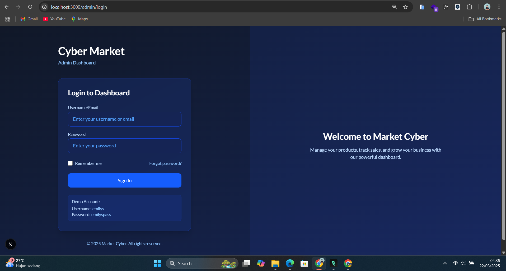
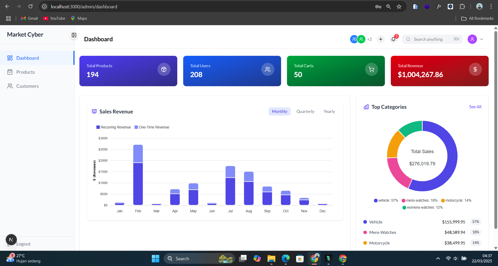

# Cyber Market - Dashboard Management



## Overview

Cyber Market adalah aplikasi dashboard manajemen e-commerce modern yang dibangun dengan Next.js. Dashboard ini menyediakan antarmuka yang intuitif dan responsif untuk mengelola berbagai aspek dari platform e-commerce, termasuk:

## Link Website
- [Cyber Market](https://cyber-market-kohl.vercel.app/)

## Fitur Lengkap
- **Monitoring Metrics**: Melihat total produk, pengguna, keranjang belanja, dan pendapatan secara real-time
- **Analisis Penjualan**: Visualisasi data penjualan dengan grafik interaktif
- **Manajemen Pelanggan**: Mengelola data pelanggan dengan fitur pencarian, filter, dan CRUD lengkap
- **Kategori Populer**: Melihat kategori produk terlaris dengan visualisasi chart

## Teknologi

Aplikasi ini dibangun menggunakan:

- **Next.js 15** - Framework React dengan fitur routing, server components, dan optimasi performa
- **TypeScript** - Untuk type safety dan developer experience yang lebih baik
- **Tailwind CSS** - Untuk styling yang cepat dan responsif
- **Framer Motion** - Untuk animasi yang smooth dan interaktif
- **DummyJSON API** - Untuk data dummy yang realistis

## Screenshots

### Landing Page


### Login Page


### Dashboard


## Getting Started

First, run the development server:

```bash
npm run dev
# or
yarn dev
# or
pnpm dev
# or
bun dev
```

Open [http://localhost:3000](http://localhost:3000) with your browser to see the result.

